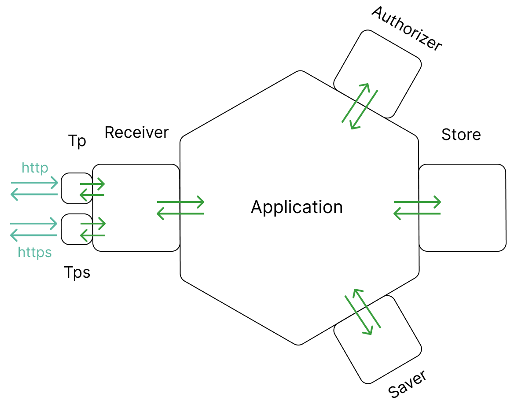

## Зависимости

...

## Запуск

Запуск новой версии осуществляется через Pull Request в master ветку репозитория

## Схема

Приложение создано на основе **hexagonal architecture**. Содержит модули для приема/отправки запросов **Tp** и **Tps**, модуль верхнеуровневой обработки запросов **Receiver**, основной модуль приложения **Application**, модуль авторизации **Authorizer**, модуль работы с хранилищем данных **Store** и модуль для сохранения логов **Saver**. Модули доступны через методы, описанные в своих интерфейсах.

Каждый модуль работает независимо и может быть изменен или протестирован без влияния на остальные.

#### Tp 

Содержит параметры и роуты HTTP сервера. В числе параметров и CORS  слой. Модуль запускает методы Receiver. Файл tp.go

#### Tps

Содержит параметры и роуты HTTPS сервера. В числе параметров CORS  слой и настройки TLS. Модуль запускает методы Receiver. Файл tps.go

#### Receiver

Читает запрос, проверяет параметры запроса , присваивает запросу уникальный идентификатор uuid, запускает нужные методы Application. Файл receiver.go

#### Application

Центральный модуль приложения. Содержит логику для запуска, остановки приложения, исполняет методы нижеописанных модулей. Файл application.go

#### Authorizer

Авторизует запрос. Файл authorizer.go

#### Store

Взаимодействует с БД Postgres. Файл store.go и postgresStore.go

#### Saver

Сохраняет логи в нужные файлы. Определяет формат наименования файлов и записей в логах. Ротирует лог при достижении предельного размера. Файл saver.go

## Обновление 

При необходимости внести изменения в текущий функционал или при расширении функционала, необходимо отредактировать код соответствующего модуля.

При добавлении нового функционала не предусматривающего расширения имеющихся модулей, необходимо:
- создать новый package
- создать новый интерфейс
- реализовать методы интерфейса 
- включить созданный модуль в список зависимостей application